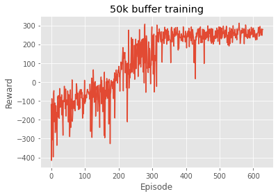

# LunarLander-v2

The goal of this project is to solve LunarLander-v2 from [OpenAI gym](https://www.gymlibrary.dev/environments/box2d/lunar_lander/) using a deep-Q network. The lander starts in the top center of the grid with a random directional force, and the goal is to land within the landing zone by engaging the thrusters on the lander. A score of >200 is considered solving the environment. Further details of the environment can be found in the gym documentation.

The goal of Q-learning is to approximate the Q-function, Q(s, a), using a deep neural network. The Q-function gives us the value of a particularly action in a particular state. As LunarLander has a continuous state space, using function approximation is a good way to solve this problem. In this case, the state space of LunarLander-v2 is just a 8-dimensional vector, so I chose to simply use some dense layers with ReLU activation.

Some different ideas tried in this project include varying how often the target network was updated, changing the size of the replay buffer, as well as tuning hyperparameters such as the learning rate. Each episode was allowed to run for 1000 time steps before terminating (even if the environment itself did not sent a termination flag), and each agent was trained over 1000 episodes or until it achieved > 200 score in the past 100 episodes.

The best agent trained in this exercise (\output\50k_buffer2023_02_08-02_55_36_AM.pth) used a 50k replay buffer, soft updates every iteration with $\tau$ = 0.01, and a learning rate of 3e-4. It achieved score > 200 in 90% of evaluation episodes.

For tuning experiments, training was terminated when the mean reward over the last 100 episodes as >220.